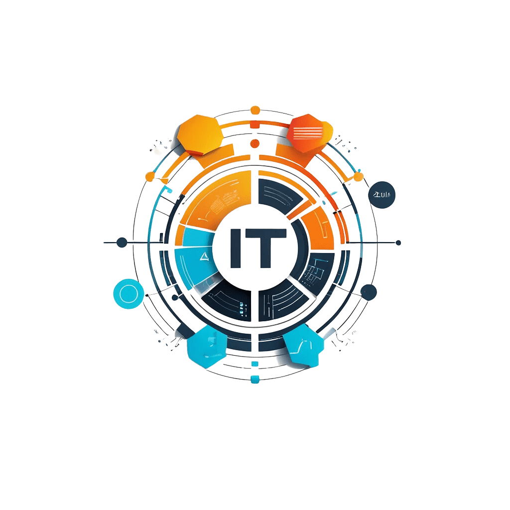

**Match IT - Analizando el Futuro de IT**

 

  

<h1 align="center">Constitución del proyecto</h1>
<h3 align="center">Datahunters IT</h3>

 Septiembre 2024

---

### Tabla de contenidos
1. [Historial de versiones](#historial-de-versiones)
2. [Información del proyecto](#información-del-proyecto)
3. [Planificación del proyecto](#planificación-del-proyecto)
4. [Desarrollo del proyecto](#desarrollo-del-proyecto)
5. [Seguimiento y control](#seguimiento-y-control)
6. [Cierre del proyecto](#cierre-del-proyecto)

---

### Historial de versiones

| Fecha      | Versión | Autor                             | Organización | Descripción                                              |
|------------|---------|-----------------------------------|--------------|----------------------------------------------------------|
| 30/08/2024 | v.0.0   | Miembros del equipo de “Datahunters IT”  | Datahunters IT | Creación de la documentación, se designan roles y tareas.|
|  | v.0.2 | Miembros del equipo de “Datahunters IT” | Datahunters IT |  |
|  | v.0.2 | Miembros del equipo de “Datahunters IT” | Datahunters IT |  |

### Información del Proyecto

| Item                  | Descripción                    |
|-----------------------|--------------------------------|
| **Organización / Equipo** | Datahunters IT                |
| **Proyecto**          | Match IT - Analizando el Futuro de IT |
| **Fecha de inicio**   | 15/08/2024                     |
| **Fecha de cierre**   |                       |
| **Cliente**           | NoCountry                       |
| **Líder de Proyecto** | Ezequiel Garcia |
| **Proyect Manager**   | Daineth Dominguez |

---

## Planificación del proyecto

### Descripción del proyecto
Identificar las habilidades y competencias más demandadas en el mercado laboral de IT mediante el análisis de datos de múltiples fuentes de empleo. Posteriormente, se desarrollará un modelo predictivo que permita anticipar habilidades emergentes y tendencias futuras en el sector, proporcionando a los profesionales y empresas de IT información valiosa para la planificación de sus estrategias de capacitación y contratación.

### Objetivo
El proyecto se enfocará en el mercado laboral de IT, con énfasis en las regiones con mayor actividad en el sector tecnológico como lo son Estados Unidos y Canadá, y se limitará a datos de este año (2024) para garantizar la relevancia y actualidad de los resultados.

#### Objetivos específicos
1. **Recopilación y Limpieza de Datos**: Recopilar y consolidar datos de diversas uentes de empleo relevantes en el sector IT dentro de Estados Unidos y Canadá para el año 2024.
2. Realizar un proceso de limpieza de datos que garantice la eliminación de duplicados, datos incompletos o inconsistentes, asegurando la calidad y precisión de la información a analizar.
3. **Análisis de Habilidades y Competencias**: Identificar y categorizar las habilidades y competencias más mencionadas en las ofertas de empleo de IT, diferenciando entre habilidades técnicas (hard skills) y habilidades interpersonales (soft skills) y realizar un análisis comparativo entre las regiones (EE.UU. y Canadá) para identificar variaciones regionales en la demanda de habilidades.
4. **Desarrollo del Modelo Predictivo**: Diseñar y entrenar un modelo predictivo utilizando técnicas de machine learning para anticipar habilidades emergentes en el sector IT, basándose en patrones históricos y tendencias actuales. Validar el modelo predictivo con un conjunto de datos independiente para asegurar su precisión y confiabilidad.
5. **Generación de Reportes y Visualizaciones**: Desarrollar reportes detallados y visualizaciones interactivas que presenten las habilidades y competencias más demandadas, así como las predicciones sobre tendencias futuras en el mercado laboral de IT y asegurar que los reportes sean accesibles y comprensibles tanto para profesionales de IT como para responsables de contratación y planificación en empresas del sector.

### Requerimientos del proyecto
Esta sección detalla los criterios y estándares que deben cumplirse durante el desarrollo del proyecto, los cuales incluyen:
1. Proyecto entregado en un repositorio de GitHub.
2. Planificación detallada de las fases de desarrollo.
3. Cumplimiento de estándares de calidad.
4. Documentación técnica y funcional del proyecto.
5. Estrategias de trabajo efectivas.
6. Plan de mantenimiento y soporte.
7. Presentación final a través de ***: *** a las *** hrs (Arg).

### Fases de desarrollo
El desarrollo del proyecto se divide en varias fases bien definidas para asegurar un progreso organizado y eficiente. Cada fase aborda diferentes aspectos del proyecto, desde la planificación inicial hasta el despliegue final, garantizando que todos los componentes se integren de manera cohesiva y funcional. A continuación, se detallan las principales etapas del desarrollo del proyecto.

#### Análisis y Diseño

El análisis y diseño del proyecto constituyen la base sobre la cual se construye todo el desarrollo posterior. En esta fase, se identifican los requisitos clave, se asignan roles y responsabilidades a los miembros del equipo, y se define el ciclo de vida del desarrollo del proyecto. 

1. **Análisis del proyecto y Brainstorming:** Reuniones para comprender en detalle los requisitos del proyecto y generar ideas sobre cómo abordarlos.
2. **Asignación de roles y responsabilidades:** Distribuir las tareas entre los miembros del equipo según sus habilidades y fortalezas para asegurar una ejecución efectiva del proyecto.
3. **Creación de repositorio y entornos de trabajo**
5. **Diseño de logo y paletas de colores**
6. **Creación de la documentación del proyecto:** Elaborar documentos detallados que describan el plan del proyecto, incluyendo objetivos, hitos y cronograma.

#### Desarrollo

El desarrollo del proyecto se lleva a cabo en iteraciones, para asegurar una entrega constante y la posibilidad de hacer ajustes rápidos.

1. Investigación y recopilación de Datos: 
2. Limpieza y Preparación de los Datos:
3. Modelado de Datos:
4. Resultados y Visualización:

#### Implementación

El desarrollo de los requerimientos se realizará utilizando Python, Pandas, NumPy, Matplotlib, Seaborn, diversas librerias de Machine Learning y la plataforma de visualizacion Power BI. Estas tecnologías permitirán la creación de una solución completa y eficiente para el análisis y visualización de datos.

#### Pruebas y Validación
Las pruebas y la validación son etapas críticas para garantizar que el sistema desarrollado cumple con los requisitos y funciona correctamente. Este proceso incluye pruebas unitarias, de integración y de aceptación, asegurando que cada componente del sistema se desempeñe de manera óptima tanto individualmente como en conjunto. 

#### Cronograma e hitos principales

| Hito                                    | Fecha               |
|-----------------------------------------|---------------------|
| Inicio        |           |
| Presentación de los miembros del equipo |           |
| Asignación de roles y responsabilidades |           |
| Análisis del proyecto y Brainstorming   |         |
| Creación de la documentación del proyecto |       |
| Aprobación de avances (30% requerimientos cubiertos) |  |
| Aprobación de avances (60% requerimientos cubiertos) |  |
| Aprobación de avances (90% requerimientos cubiertos) |  |
| Aprobación de avances (100% requerimientos cubiertos) |  |
| Finalización de la simulación (DemoDay) |  hr (ARG) |

#### Talento humano

| Nombre                         | Roles                             | Tareas                         | Departamento/División          |
|--------------------------------|-----------------------------------|-------------------------------|-------------------------------|
|   |  |  |
|  |                   |                               |         |
|  |                     |                               |         |
|  |  |                  |      |
| Karina Ordoñez Gonzalez        | Data science                      |                               |       |
|          |                      |                               |           |

---

### Desarrollo del proyecto

El desarrollo del proyecto se llevó a cabo utilizando una combinación de técnicas avanzadas de análisis de datos y Machine Learning, implementando metodologías ágiles y asegurando una entrega eficiente y de alta calidad.

1. **Preprocesamiento de datos:** Limpiar y transformar los datos para su análisis.
2. **Análisis exploratorio:** Realizar un análisis exhaustivo para identificar patrones y tendencias en los datos.
3. **Desarrollo de modelos:** Crear y entrenar modelos predictivos y de segmentación.
4. **Visualización de datos:** Crear visualizaciones interactivas que faciliten la comprensión de los resultados.
5. **Desarrollo de la aplicación:** ????? I

#### Tecnologías Utilizadas
- Python: Lenguaje de programación principal para el análisis y procesamiento de datos.
- Pandas: Biblioteca para la manipulación y análisis de datos.
- NumPy: Biblioteca para cálculos numéricos eficientes.
- Matplotlib: Biblioteca para la creación de gráficos y visualizaciones.
- Seaborn: Biblioteca para visualización de datos estadísticos.

### Seguimiento y control

Medir y controlar frecuentemente el avance del proyecto para identificar posibles variaciones y discrepancias en relación con el plan original y corregirlas si fuese el caso.

#### Pruebas y Validación
Ejecución de pruebas para asegurar que el sistema cumple con los requisitos y no tiene errores.

1. **Pruebas unitarias:** Verificar que cada componente del sistema funciona correctamente de manera aislada.
2. **Pruebas de integración:** Asegurar que los diferentes componentes del sistema funcionan correctamente en conjunto.
3. **Pruebas de aceptación:** Validar que el sistema cumple con los requisitos del cliente y está listo para su uso.

### Cierre del proyecto
Finalización de todas las actividades, grupos de proceso de gestión y formalización de la presentación del producto software. Realización de una reunión de cierre para revisar los logros y áreas de mejora, y documentar las lecciones aprendidas.

#### Implementación y Despliegue
Despliegue del sistema en un entorno de producción.

---

### Instrucciones de Uso
1. Clona el repositorio desde GitHub.
2. Crea un entorno virtual y asegúrate de tener instaladas todas las dependencias listadas en el archivo `requirements.txt`.
3. Instala las dependencias necesarias ejecutando `pip install -r requirements.txt` en tu entorno virtual para la parte de Python.
4. Asegúrate de configurar correctamente las variables de entorno según las necesidades del proyecto.

### Interpretacion del Modelo
